# 🏠 Home Lab Network Monitoring

**Home Lab Network Monitoring using VMware Workstation, Windows Server 2022, Kali Linux, and Wireshark**

[]()
[]()
[]()

> A personal home lab project capturing and analyzing network traffic (ARP, ICMP, DNS,
> TCP, and HTTP) between two virtual machines using Wireshark.

**Author:** Sumit Kumar

---

## 📖 Table of Contents

1. [Objective](#1-objective)
2. [Lab Environment](#2-lab-environment)
3. [Windows Server 2022 Installation](#3-windows-server-2022-installation)
4. [Network Configuration](#4-network-configuration)
5. [Connectivity Testing](#5-connectivity-testing)
6. [ICMP Traffic Analysis](#6-icmp-traffic-analysis)
7. [DNS Traffic Analysis](#7-dns-traffic-analysis)
8. [HTTP Traffic Analysis](#8-http-traffic-analysis)
9. [TCP Protocol Analysis](#9-tcp-protocol-analysis)
10. [ARP Protocol Analysis](#10-arp-protocol-analysis)
11. [Protocol Hierarchy Statistics](#11-protocol-hierarchy-statistics)
12. [Protocol Summary](#12-protocol-summary)
13. [Results](#13-results)
14. [Conclusion](#14-conclusion)
15. [Screenshots](#-screenshots)
16. [Folder Structure](#-folder-structure)

---

## 1. Objective

The objective of this project is to create a home lab environment using VMware
Workstation with Windows Server 2022 and Kali Linux virtual machines. Wireshark is used
to capture and analyze network traffic, including ICMP, DNS, and HTTP communications.
Additional protocol analysis is performed to understand network behavior and packet
structures.

---

## 2. Lab Environment

### Software Used

1. VMware Workstation
2. Windows Server 2022
3. Kali Linux
4. Wireshark
5. Nmap

### Virtual Machine Setup

The lab environment consists of two virtual machines connected through a virtual
network.

**Figure 1 — VMware Lab Environment (VM Library)**

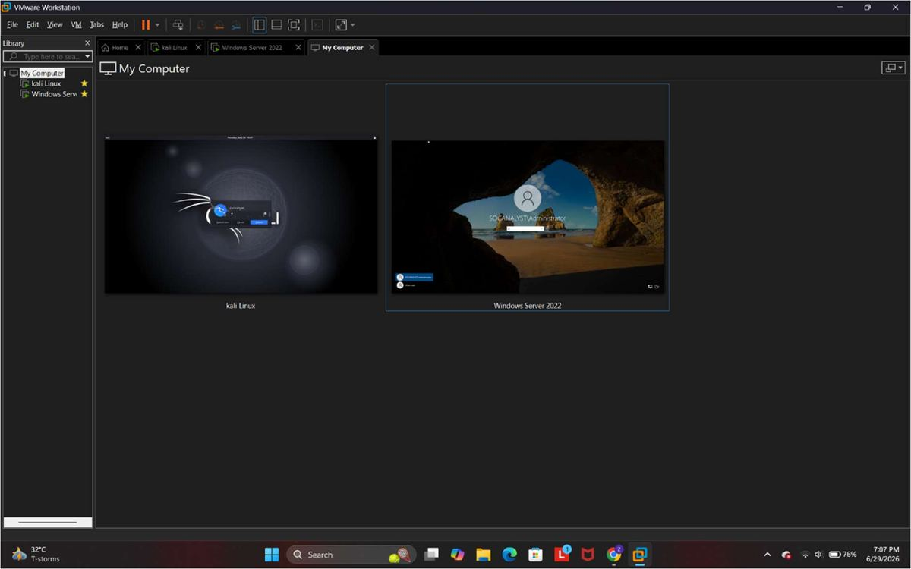

**Description:** The VirtualBox environment showing Windows Server 2022 and Kali Linux
virtual machines successfully configured and running.

---

## 3. Windows Server 2022 Installation

**Figure 2 — Windows Server Desktop**

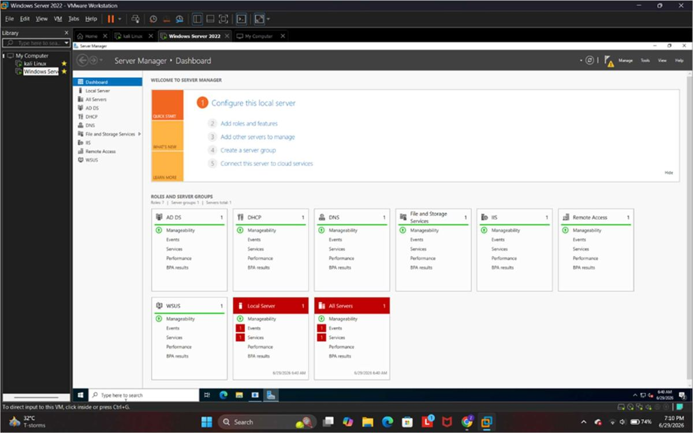

**Description:** Windows Server 2022 installed successfully.

**Figure 3 — Windows Version Verification**

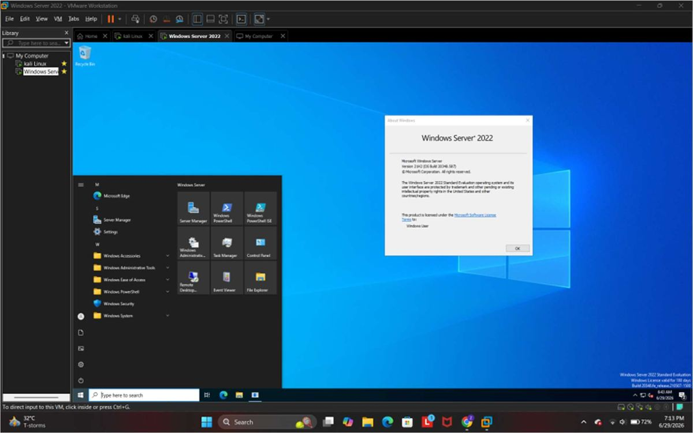

**Description:** The `winver` command confirms that Windows Server 2022 is installed.

---

## 4. Network Configuration

**Figure 4 — Windows Server IP Configuration**

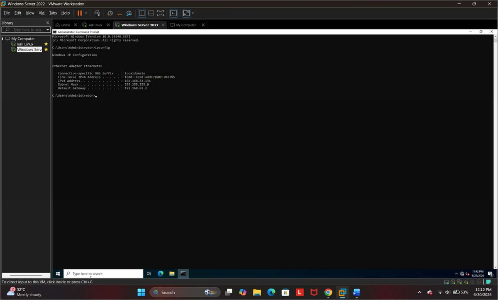

**Description:** IP configuration displayed using the `ipconfig` command.

```cmd
ipconfig
```

**Figure 5 — Kali Linux IP Configuration**

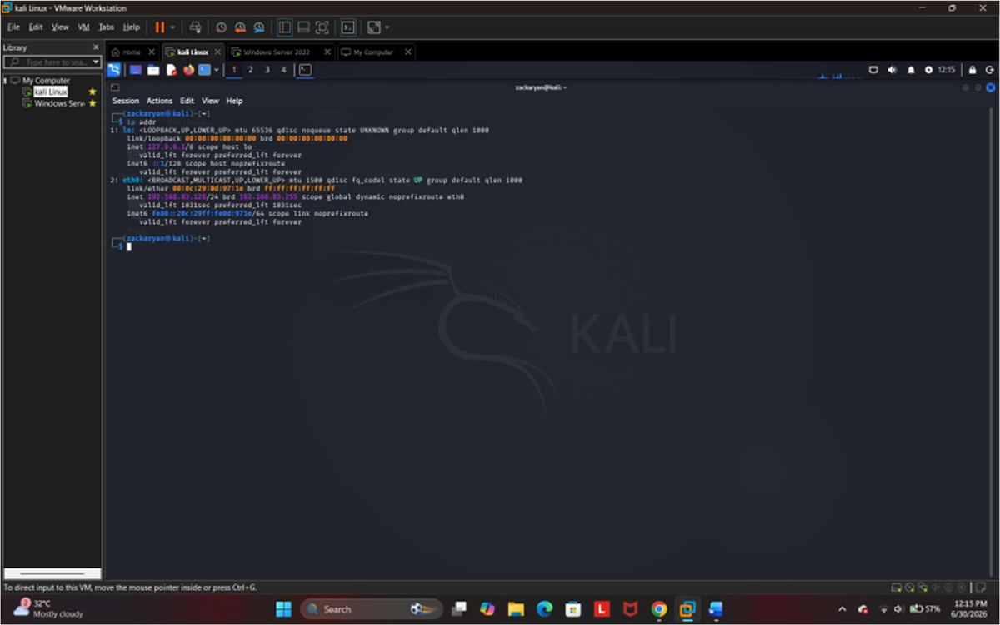

**Description:** IP configuration displayed using the `ip a` command.

```bash
ip a
ip addr
```

---

## 5. Connectivity Testing

**Figure 6 — Ping Test from Kali Linux to Windows Server**

```bash
ping 192.168.83.134
# To stop the ping command, press Ctrl + C
```

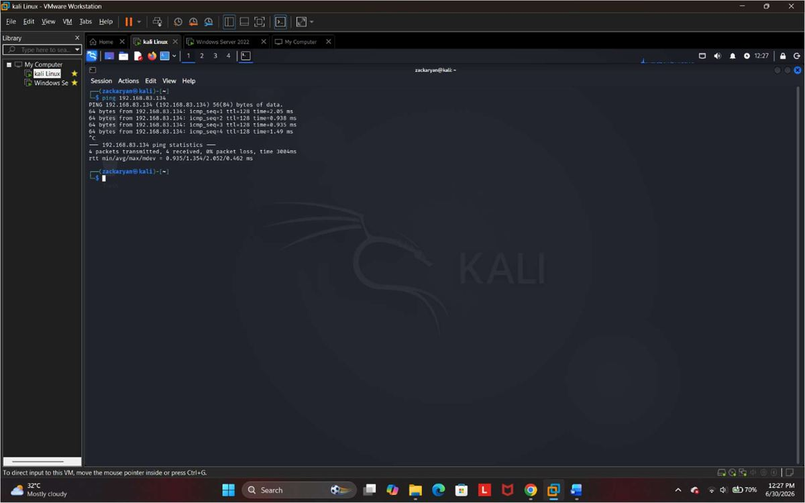

**Observed in Kali Linux terminal:**
- `ping 192.168.83.134` command executed
- Multiple successful replies
- 0% packet loss
- Ping statistics displayed
- VMware environment

**Description:** ICMP packets successfully transmitted from Kali Linux to Windows
Server.

**Figure 7 — Ping Test from Windows Server to Kali Linux**

```cmd
ping 192.168.83.128
```

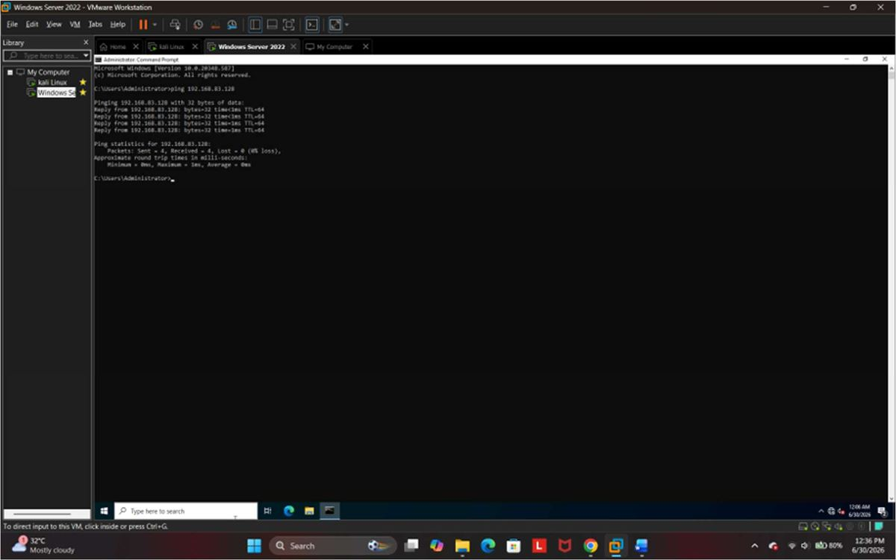

**Description:** Successful connectivity confirmed between both virtual machines.

---

## 6. ICMP Traffic Analysis

**Figure 8 — ICMP Packet Capture**

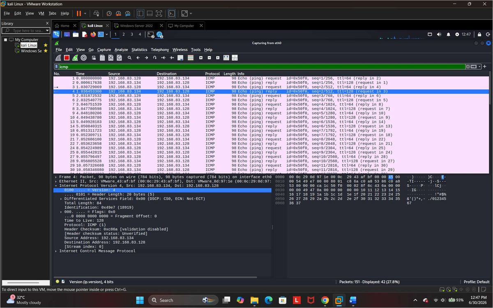

**Filter Used:** `ICMP`

**Analysis:**

| Field | Observation |
|---|---|
| Protocol | ICMP |
| Source IP | 192.168.83.128 |
| Destination IP | 192.168.83.134 |
| Packet Type | Echo Request / Echo Reply |
| TTL | 64 / 128 |

**Findings:** ICMP packets were captured successfully during ping operations. Echo
Request and Echo Reply messages confirmed network connectivity between the virtual
machines.

---

## 7. DNS Traffic Analysis

**Figure 9 — DNS Packet Capture**

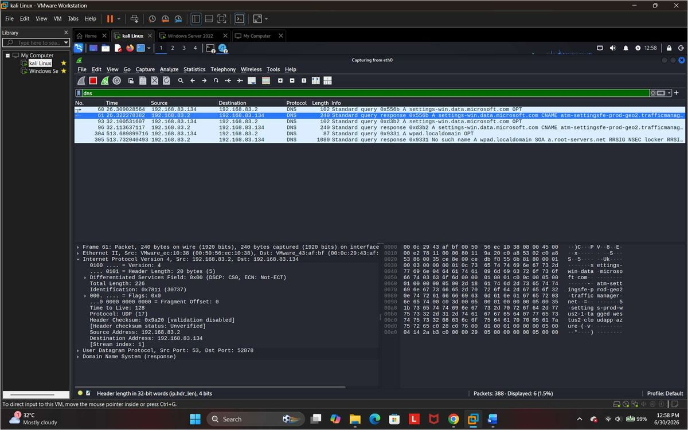

**Filter Used:** `DNS`

**Analysis:**

| Field | Observation |
|---|---|
| Protocol | DNS |
| Transport Protocol | UDP |
| Source Port | 53 |
| Query Type | A Record |
| Protocol Purpose | Domain Name Resolution |

**Findings:** DNS packets were captured successfully. The DNS server resolved domain
names into IP addresses.

---

## 8. HTTP Traffic Analysis

**Figure 10 — HTTP Packet Capture**

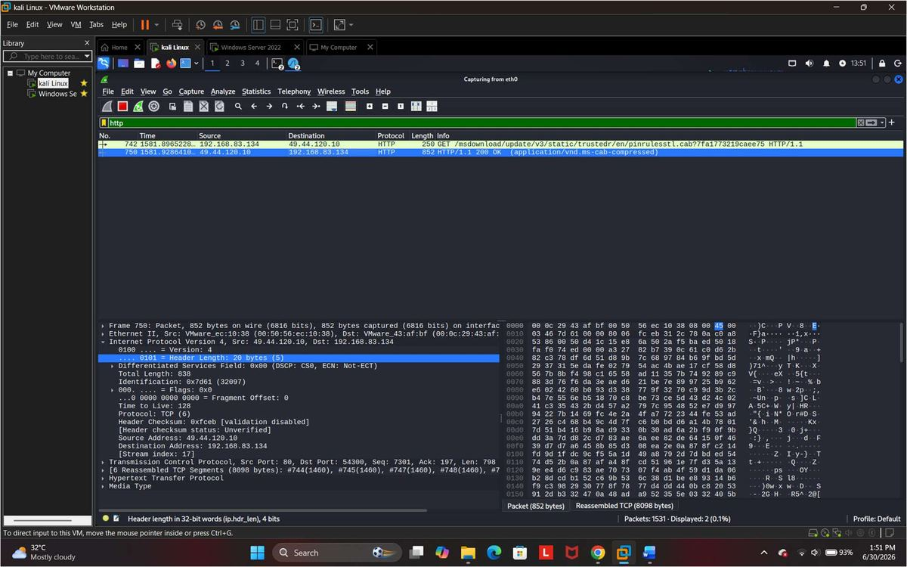

**Filter Used:** `HTTP`

**Analysis:**

| Field | Observation |
|---|---|
| Protocol | HTTP |
| Method | GET |
| Response | HTTP/1.1 200 OK |
| Transport Protocol | TCP |
| Source IP | 49.44.120.10 |
| Destination IP | 192.168.83.134 |

**Findings:** HTTP traffic was captured successfully. The packets show communication
between a client and a web server using the HTTP protocol.

---

## 9. TCP Protocol Analysis

**Figure 11 — TCP Packet Capture**

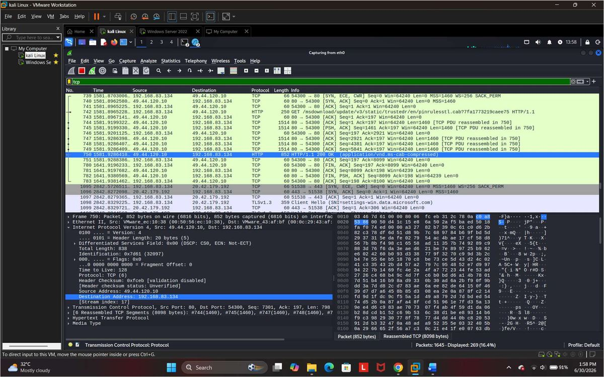

**Filter Used:** `TCP`

**Analysis:**

| Field | Observation |
|---|---|
| Protocol | TCP |
| Source Port | 54300 |
| Destination Port | 80 |
| Flags Observed | SYN, SYN-ACK, ACK |
| Purpose | Reliable Data Transfer |
| Sequence Number | 7301 |

**Findings:** TCP packets demonstrate reliable communication using acknowledgments and
sequence numbers.

---

## 10. ARP Protocol Analysis

**Figure 12 — ARP Packet Capture**

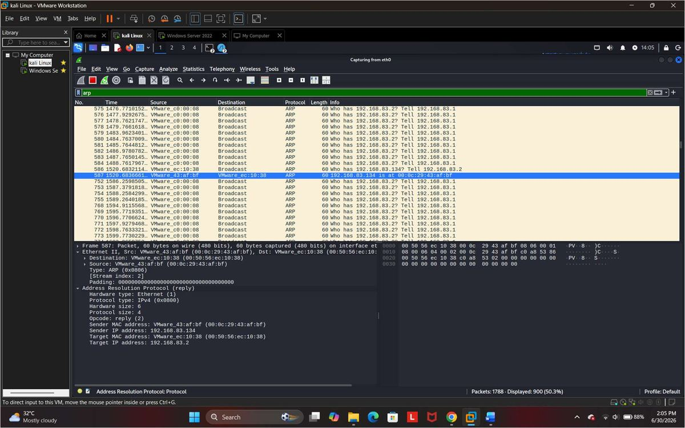

**Filter Used:** `ARP`

**Analysis:**

| Field | Observation |
|---|---|
| Protocol | ARP |
| Sender IP | 192.168.83.134 |
| Target IP | 192.168.83.2 |
| Operation | ARP Request / Reply |
| Purpose | IP to MAC Address Resolution |

**Findings:** ARP packets were observed resolving IP addresses into MAC addresses for
local network communication.

---

## 11. Protocol Hierarchy Statistics

**Figure 13 — Protocol Hierarchy**

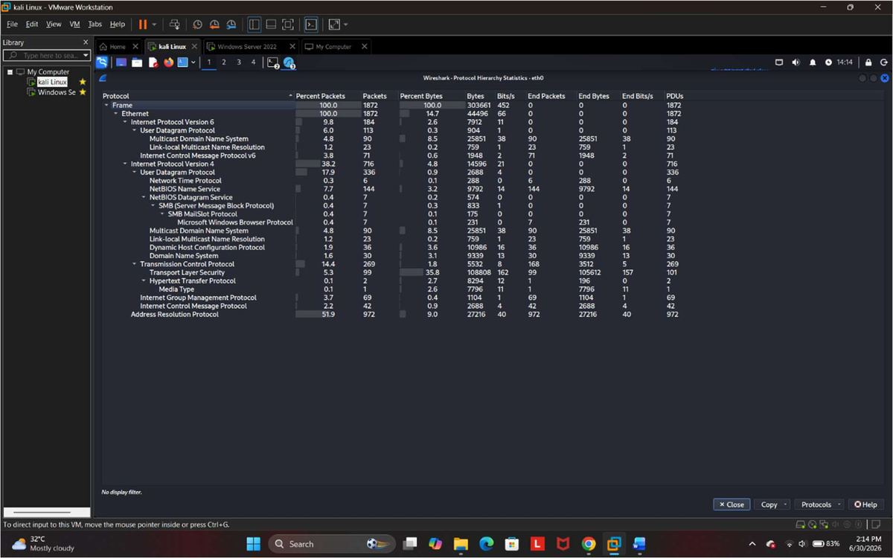

**Description:** Protocol Hierarchy statistics generated by Wireshark showing the
distribution of captured protocols.

---

## 12. Protocol Summary

| Protocol | Purpose | Observed |
|---|---|---|
| ARP | IP-to-MAC address resolution | Yes |
| ICMP | Connectivity testing (Ping) | Yes |
| DNS | Domain name resolution | Yes |
| TCP | Reliable transport protocol | Yes |
| HTTP | Web communication | Yes |

---

## 13. Results

The home lab network monitoring project was successfully completed using VMware
Workstation, Windows Server 2022, Kali Linux, and Wireshark. Network traffic was
captured and analyzed for multiple protocols including ARP, ICMP, DNS, TCP, and HTTP.
Packet captures confirmed successful communication between virtual machines and
external network services.

---

## 14. Conclusion

This project demonstrated the setup of a virtual network monitoring environment and the
use of Wireshark for packet analysis. The analysis of ICMP, DNS, HTTP, TCP, and ARP
traffic provided practical understanding of network communication and protocol behavior.
The project successfully met all objectives related to traffic capture, protocol
analysis, and documentation.

---

## 🖼️ Screenshots

All figures referenced in this report are available in [`docs/`](docs/):

| Figure | File |
|---|---|
| Figure 1 – VMware Lab Environment (VM Library) | `docs/fig02-windows-server-desktop-server-manager.jpg` |
| Figure 2 – Windows Server Desktop | `docs/fig03-windows-version-verification-winver.jpg` |
| Figure 3 – Windows Version Verification | `docs/fig04-windows-server-ip-configuration.jpg` |
| Figure 4 – Windows Server IP Configuration | `docs/fig05-kali-linux-ip-configuration.jpg` |
| Figure 5 – Kali Linux IP Configuration | `docs/fig06-ping-test-kali-to-windows-server.jpg` |
| Figure 6 – Ping Test (Kali → Windows Server) | `docs/fig07-ping-test-windows-server-to-kali.jpg` |
| Figure 7 – Ping Test (Windows Server → Kali) | `docs/fig08-icmp-packet-capture.jpg` |
| Figure 8 – ICMP Packet Capture | `docs/fig09-dns-packet-capture.jpg` |
| Figure 9 – DNS Packet Capture | `docs/fig10-http-packet-capture.jpg` |
| Figure 10 – HTTP Packet Capture | `docs/fig11-tcp-packet-capture.jpg` |
| Figure 11 – TCP Packet Capture | `docs/fig12-arp-packet-capture.jpg` |
| Figure 12 – ARP Packet Capture | `docs/fig13-protocol-hierarchy-statistics.jpg` |
| Figure 13 – Protocol Hierarchy Statistics | `` |

---

## 📁 Folder Structure

```
Home-Lab-Network-Monitoring/
│
├── README.md
├── LICENSE
├── .gitignore
│
└── docs/
    ├── Home_Lab_Network_Monitoring_Report.pdf   # Original full report
    └── Screenshots/                              
```

---

## 👤 Author

**Sumit Kumar**

Personal home lab project built using VMware Workstation to practice virtual network
setup, connectivity testing, and packet-level protocol analysis with Wireshark.
